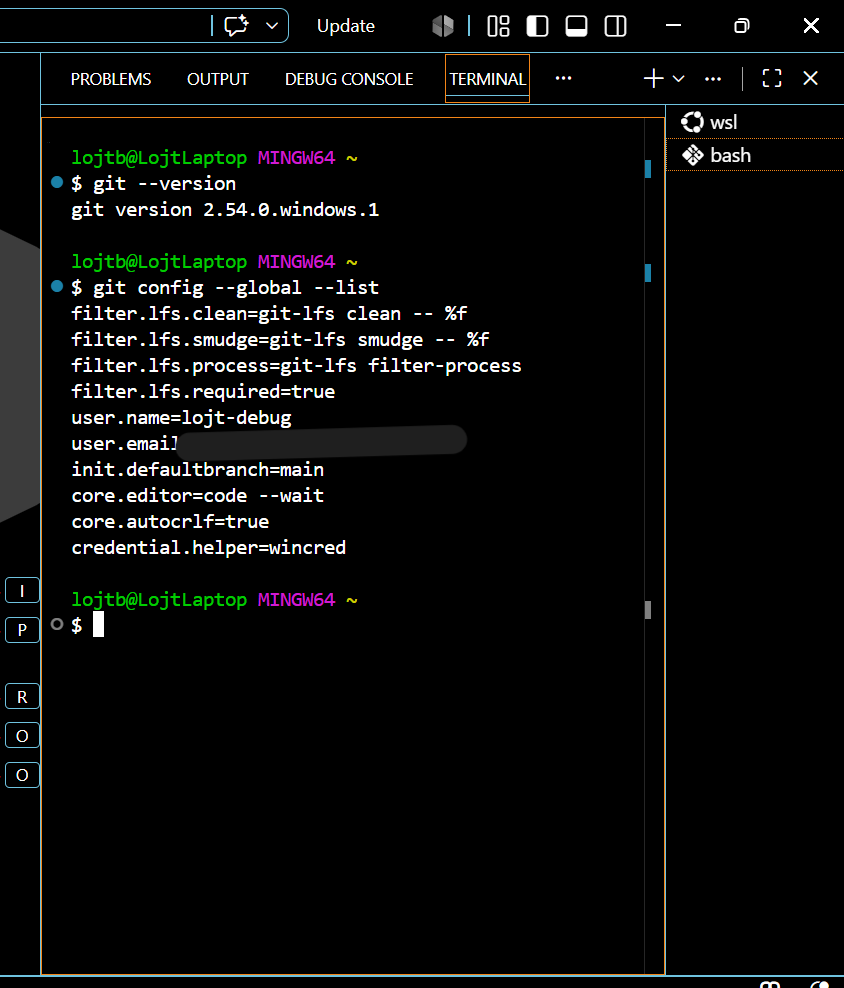
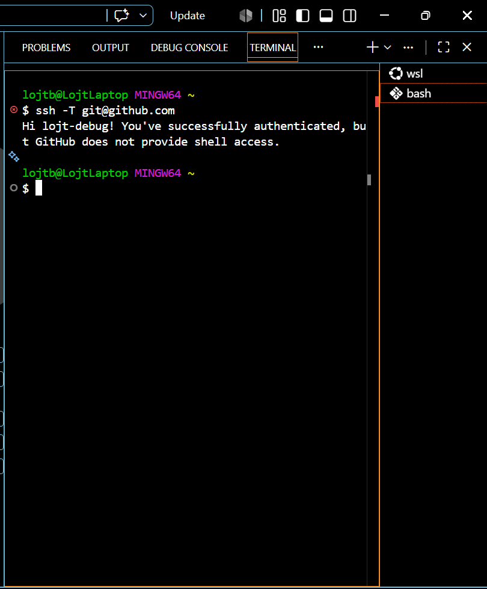
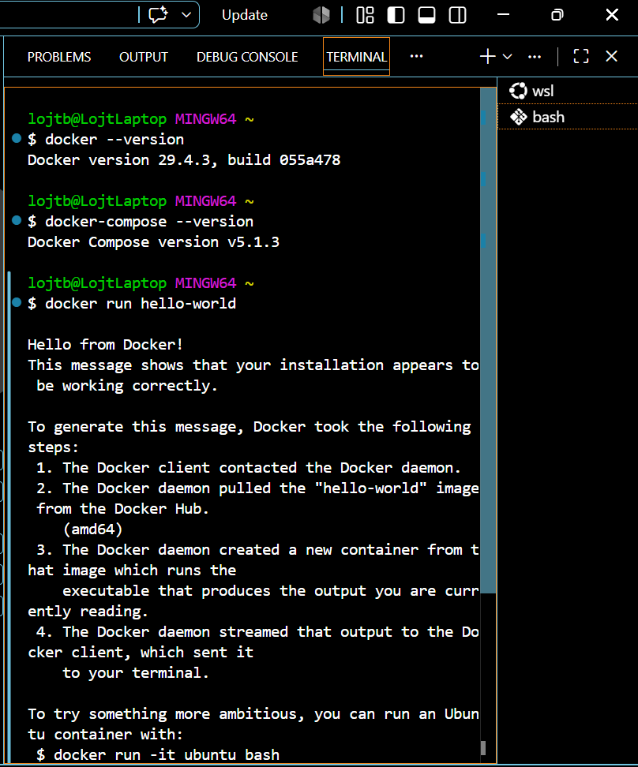
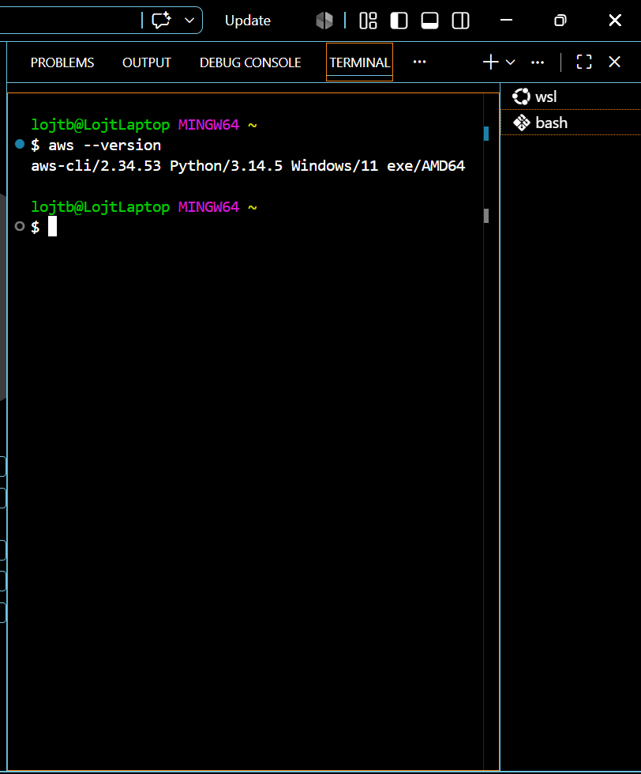
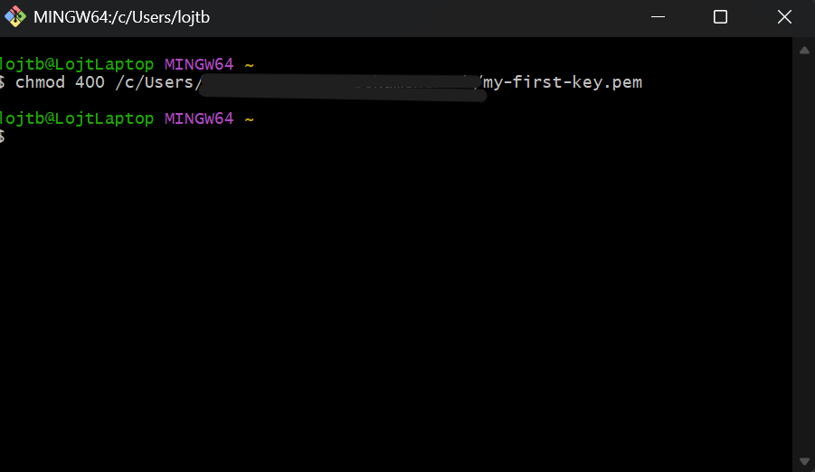
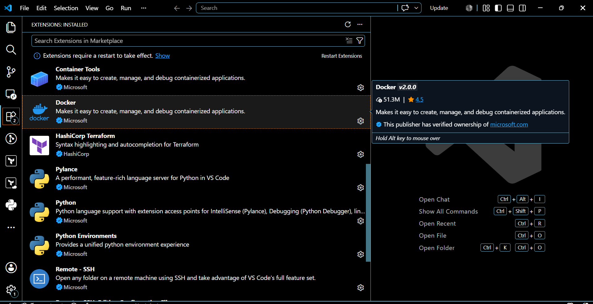
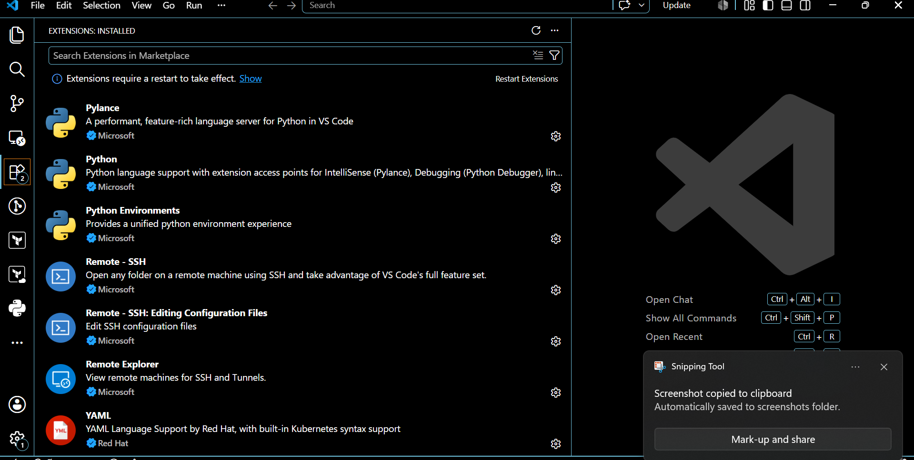
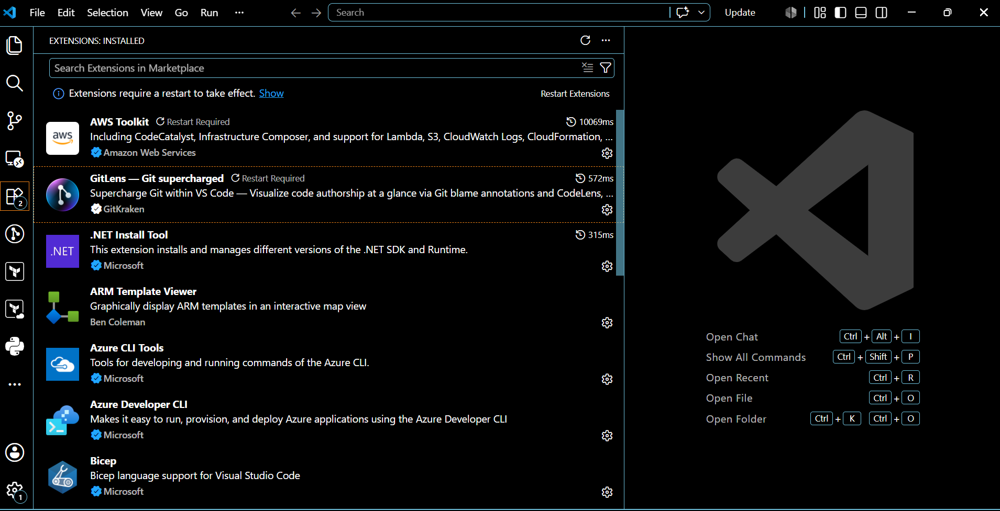
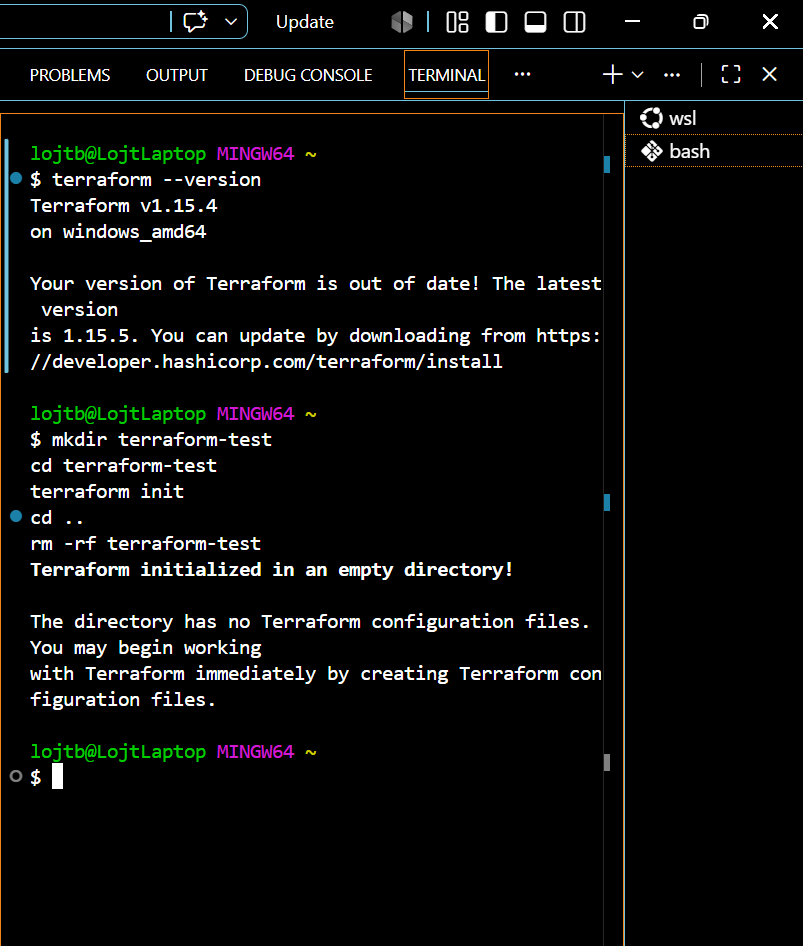

# Prework: Environment Setup, Git, Docker, Linux Basics

## What I built
- Set up a full local dev environment on Windows: VS Code, Git Bash, Docker,
  Terraform CLI, AWS CLI
- Configured Git with SSH authentication to GitHub
- Verified all tool installations and versions (see `environment-verification.txt`)
- Installed and reviewed key VS Code extensions for cloud/DevOps work:
  Docker, HashiCorp Terraform, Python, AWS Toolkit, GitLens, Azure CLI Tools,
  Remote-SSH, YAML, .NET, Bicep, ARM Template Viewer

## What I learned
- Learning Git's architecture initially felt confusing — especially how local
  changes sync with the remote.
- A push can fail when the local branch hasn't pulled the latest remote
  changes first (non-fast-forward rejection) — the fix is always to pull
  `main` before a final push.
- Using AI tools to break down intimidating terminal error messages into
  plain English dramatically sped up troubleshooting.
- The modern `git switch` command is more intuitive than `git checkout` for
  branch management — it cleanly separates branch switching from file
  restoration, even though it's still listed as experimental.
- Small typos have an outsized impact in this work — paying close attention
  to exact syntax matters more than I expected.

### Linux terminal fundamentals
- The built-in `man` command was genuinely useful — checking what a command
  does before running it saved several mistakes.
- The terminal is noticeably faster than clicking through a GUI once the
  basic commands click.
- Chaining commands with pipes cuts down on repetitive typing and makes
  workflows more efficient — though it's easy to lose track mid-pipe of
  which command is actually being used.
- Understanding the difference between absolute and relative file paths took
  practice but became clear over time.
- Next curiosity: shell scripting and building small automated workflows.

## What was hard
- Diagnosing a failed push caused by a missing local merge of remote changes.
- Getting comfortable with terminal-first workflows instead of defaulting to
  GUI tools — actively working on reducing reliance on heavy GUIs like VS
  Code in favor of terminal/Vim fluency.

## Tool versions verified
See `environment-verification.txt` for the full list (Git, Docker, Terraform,
AWS CLI, VS Code — all confirmed working with SSH + AWS CLI configured).

## Deeper notes
- [Networking fundamentals reflection](./notes/networking-fundamentals-reflection.md) —
  DNS resolution, IP routing/packets, HTTP/HTTPS, and the full request
  lifecycle from URL to rendered page.

## Screenshots

